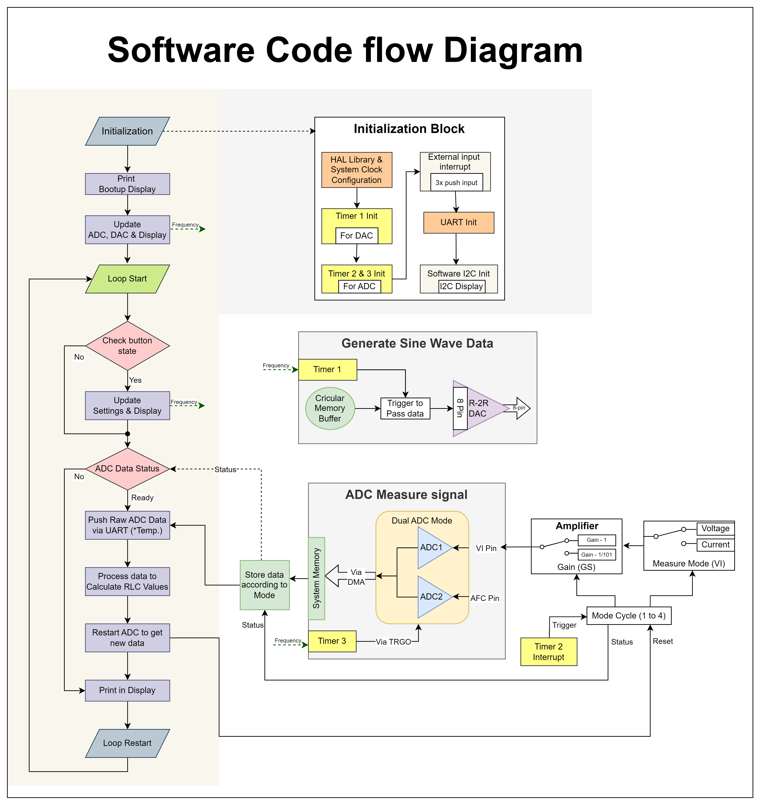

## Software flow Diagram

<figure markdown="span">
  { width="700" }
</figure>

## Signal Generator (DAC) 
- PB0 to PB7 $\rightarrow$ R-2R Ladder  
- Eight(PB0-PB7) digital pin
- With 8-bit resolution has 256 steps
- sine wave data circular buffer applied via interrupt 
### Timer 1
  - Generator Sine Wave via digital pin PB0 to PB7.
  - Timer Specs 
    - Prescaler: 2
    - Interval: $\frac{1}{frequency}* \frac{1}{100}$

## Voltage & Current measure
### Pin Description

#### VI - PA7 Pin
| Measure  | VI   |
|----------|------|
| Volt     | LOW  |
| Current  | HIGH |

#### GS - PA6 Pin
*  LOW - <TBA> 
* HIGH - Gain is unity
#### ADC - PA0, PA1 Pin
* PA0 - Voltage, Current measurement
* PA1 - Automatic Factor Correction(AFC)

### Measurement Mode Handling
* Four possible mode with VI & GS pin
* To get proper measurement, set mode & measure with some time gap
* Totally 8 mode, cyclic via Timer 2 interrupt with below parameter
#### Timer 2
  - VI Measurement toggle switch.
  - Timer Specs 
    - Prescaler: 72000
    - Interval: 250ms
> **Community support** - ADC timer Implementation [link](https://community.platformio.org/t/in-stm32f103-how-to-create-two-timer-interrupt-running-without-disturb-each-other/43870/2)\
> Special Thanks to [Maximilian Gerhardt](https://github.com/maxgerhardt)

## ADC Configuration
* Dual Mode for PA0(ADC0) & PA1(ADC1)
* Each sample capture is controlled by Timer 3 via TRGO.
* Direct Memory Access(DMA) for ADC to offload the CPU load.
* DMA overflow interrupt to capture and transfer the ADC sample data to particular array.
### Timer 3
  - To trigger ADC start measurement via TGRO in ADC. 
  - Timer Specs 
    - Prescaler: 8
    - Interval: $\frac{1}{sampling frequency}$

## Display
 PA4 (as SCL) & PA3 (as SDA) is used as I2C connection for SSD1306 display with 128x64 resolution. 
### Implementation
* PA3 & PA4 doesn't support in I2C native of this MCU, so software(bit-banging) i2c interface is created my modifying the [tobajer/i2cbitbang library](https://github.com/tobajer/i2cbitbang).

* To control display on top of STM32 HAL, used the modified library name [4ilo/ssd1306-stm32HAL](https://github.com/4ilo/ssd1306-stm32HAL) which is fork from [afiskon/stm32-ssd1306](https://github.com/afiskon/stm32-ssd1306) library.

> **Community support** - 

> Display with non standard I2C pin [link](https://community.platformio.org/t/ssd1306-display-is-not-working-on-bluepill-board-stm32f103/43752/10)

> Special Thanks to [Maximilian Gerhardt](https://github.com/maxgerhardt)

## Miscellaneous Section
### User Button
* PB13 - Hold 
* PB14 - S/P Serial/ Parallel
* PB15 - RCL Mode