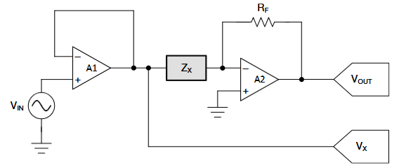
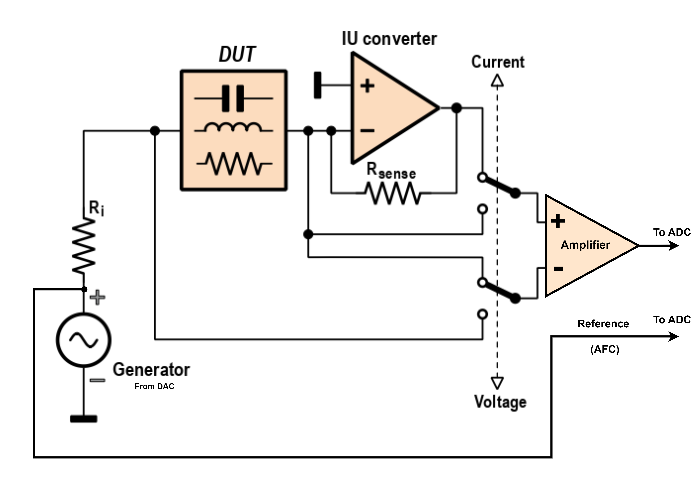
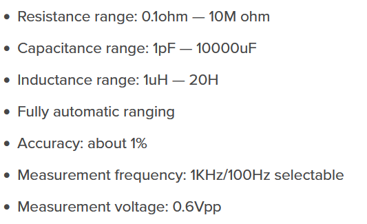
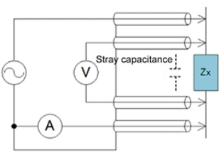

## Core Concept

The M181 LCR Meter operates by applying a fixed sine wave voltage to the Device Under Test (DUT) through a series resistor. It measures the voltage drop (V), current (I), and the phase difference between V and I to calculate the complex impedance. Using this impedance, the following parameters of the DUT can be derived:

- Inductance (L)
- Capacitance (C)
- Resistance (R)

Additionally, the Dissipation Factor (D) and Equivalent Series Resistance (ESR) can also be calculated.

<figure markdown="span">
  { width="400" }
  <figcaption>Core Concept</figcaption>
</figure>

<figure markdown="span">
  { width="400" }
  <figcaption>Implemented Method</figcaption>
</figure>

## Capability

The manufacturer (JYETech) specifies the following capabilities:

<figure markdown="span">
  { width="400" }
</figure>
> Image source: [JYETech M181 LCR Meter](https://jyetech.com/m181-lcr-meter/)

## Design Files

- [Schematics File](https://jyetech.com/wp-content/uploads/Schematic_M181.pdf)  
- [Assembly Guide](https://jyetech.com/wp-content/uploads/M181_AssemblyGuide.pdf)

## Block-wise Explanation

### Power Tree

1. USB input voltage: 5V  
2. Charge pump (TPS60403 IC) generates dual voltage: ±5V  
3. LDO regulates voltage to 3.3V  

### Signal Generator (DAC)

To generate a sine wave with a fixed frequency, a DAC is required. Since the MCU lacks an inbuilt DAC, an external R-2R ladder DAC is used.

> Detailed explanation: [Digital-to-Analog Conversion (R-2R DAC)](https://www.tek.com/en/blog/tutorial-digital-analog-conversion-r-2r-dac)

- R-2R ladder DAC is implemented using digital pins (8-bit resolution).  
- The DAC output is connected to a voltage follower (U4C).  
- Two RC low-pass filters ($F_c = 723Hz$) are connected to smooth the signal.  
- The output is tapped for Automatic Factor Correction (AFC) and connected to the MCU's ADC.  
- Further, an RC high-pass filter ($F_c = 312Hz$) blocks DC, followed by another voltage follower (U4D) to provide the final output.

### Trans-impedance Amplifier

This section converts the current ($I_X$) through the DUT into a voltage ($V_O$) using the formula:  
$$
V_O = I_X \times R_F
$$

### Kelvin (4-wire) Measurement

- Two dedicated wires measure the voltage across the DUT.  
- A switch toggles between voltage and current measurement modes.

<figure markdown="span">
  { width="400" }
</figure>
> Image source: [Kelvin Resistance Measurement](https://www.allaboutcircuits.com/textbook/direct-current/chpt-8/kelvin-resistance-measurement/)

**Note:** Calibration is required to compensate for probe errors.

### Amplifier Section

- Instrument amplifiers (U2A, U2C, U2D) with a fixed gain of 5.25.  
- A non-inverting amplifier with a gain of 100 adds an offset voltage (-1.77V) and connects to the MCU's ADC.  
- Amplitude adjustment is achieved via gain selection (voltage divider) and a high-pass filter (DC block).  
- The gain is selectable via the GS pin, allowing unity gain or attenuation by a factor of $\frac{1}{101}$.

### Miscellaneous Section

1. I2C 128x64 resolution SSD1306 display.  
2. Three push buttons for user input/control.  
3. SWD signals terminated at the J3 header.  
4. UART signals connected to the CH340N USB serial interface.