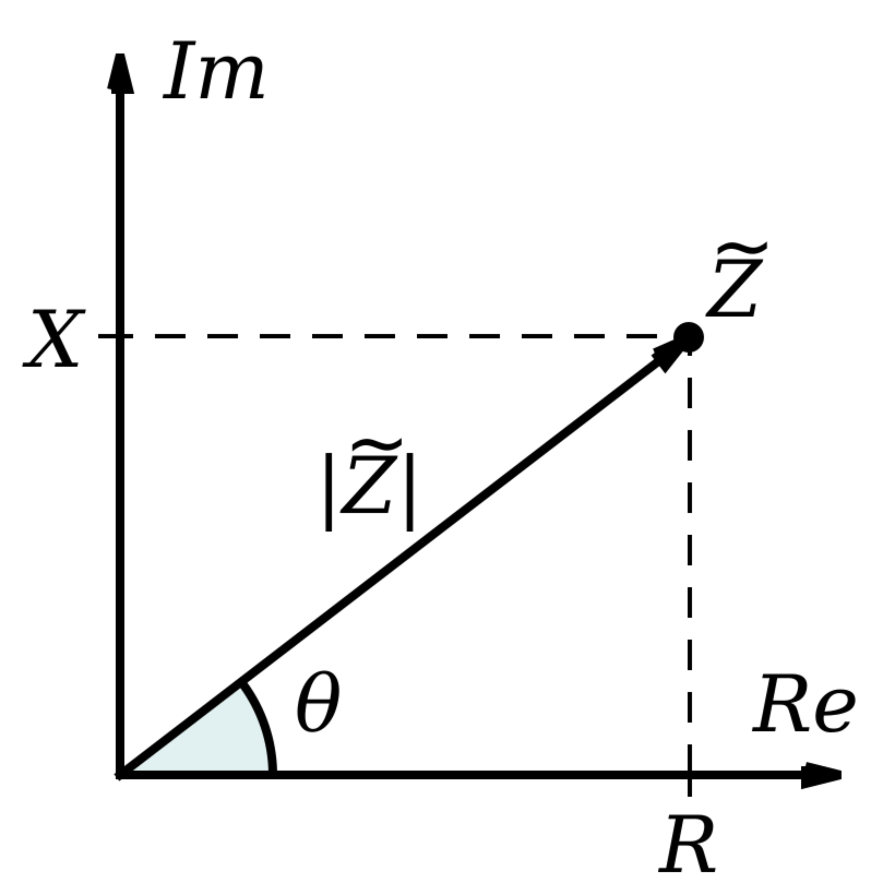
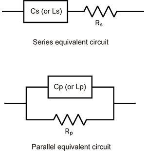

## Basic Terms

### Complex Impedance

<figure markdown="span">
  { width="200" }
</figure>

- **Polar Form:** $\displaystyle\vec{Z} = Z \angle\theta$  
- **Cartesian Form:** $Z = R + jX$  

Where:  
- $\vec{Z}$ → Impedance vector in polar form.  
- $Z$ → Magnitude of the impedance.  
- $\theta$ → Phase angle.  
- $R$ → Resistance (real part).  
- $X$ → Reactance (imaginary part).  

### Conversion Between Forms

#### Polar → Cartesian Form
- Resistance: $R = |Z| \cdot \cos \theta$  
- Reactance: $X = |Z| \cdot \sin \theta$  

#### Cartesian → Polar Form
- Magnitude: $Z = \sqrt{R^2 + X^2}$  
- Phase Angle: $\angle \theta = \tan^{-1}\left(\frac{X}{R}\right)$  

## Typical Equations for LCR Meters

LCR meters measure the impedance by analyzing the current ($I$) flowing through the DUT and the voltage ($V$) across its terminals. These meters calculate not only the ratio of RMS values of $I$ and $V$ but also the phase difference between their waveforms.

### Impedance Calculation
$$
\vec{Z} = \frac{|V| \angle \theta_V}{|I| \angle \theta_I} = \frac{|V|}{|I|} \angle (\theta_V - \theta_I) = |Z| \angle\theta
$$

### Reactance
- **Capacitive Reactance:** $X_C = \frac{1}{2\pi fC}$  
- **Inductive Reactance:** $X_L = 2\pi fL$  

> **References:**  
> 1. [LCR Meter Basic Measurement Principles](https://www.hioki.com/in-en/learning/usage/lcr-meters_1.html)  
> 2. [Typical Equations for LCR Meters](https://www.hioki.com/in-en/learning/usage/lcr-meters_2.html)  
> 3. [Complex Impedance (Wikipedia)](https://en.wikipedia.org/wiki/Electrical_impedance#Complex_impedance)

### Equivalent Circuit Model

<figure markdown="span">
  { width="250" }
</figure>

## Calibration

Calibration involves performing open and short corrections to ensure accurate measurements.  

**Details will be added soon...**