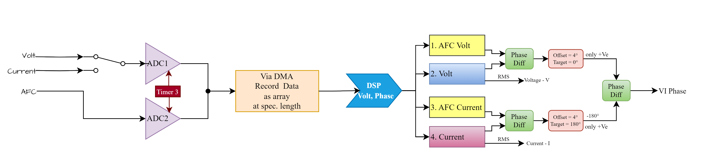
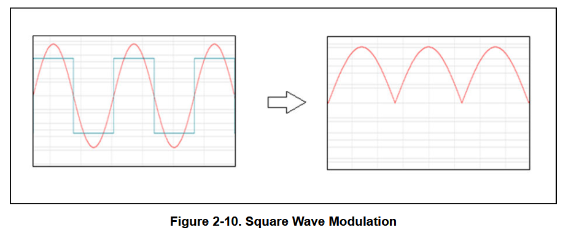
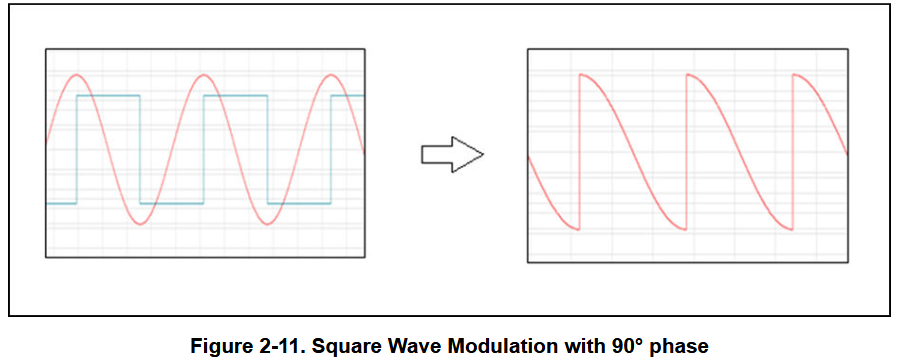

## Base Concept
 Calculation done below order
 1. Remove the DC offset in all signal.
 2. RMS Amplitude of voltage, current signal.
 3. Calculate RMS Voltage, Current
 4. With modulation method, calculate the phase
 5. Now derive the complex impedance value

<figure markdown="span">
  { width="700" }
</figure>

>Reference from TI [TIDA-060029](https://www.ti.com/lit/ug/tidueu6b/tidueu6b.pdf)

### Amplitude & Phase calculation
#### RMS value - Voltage & Current
RMS(Root Mean Square) is the square root of the mean square of a set of numbers or a continuous function
$$
x_\text{RMS} = \sqrt{ \frac{1}{n} \left( {x_1}^2 + {x_2}^2 + \cdots + {x_n}^2 \right) }.
$$

#### Synchronous Demodulation - Phase
The voltages are acquired using a two channel differential ADC and processed in the following form. Followed below steps

1. Modulation of the signal by multiplying the signal with a unity magnitude square wave of 0 degree phase and taking the average of the resulting signal ($V_1$).
    <figure markdown="span">
    { width="700" }
    </figure>

2. Modulation of the signal by multiplying the signal with a unity magnitude square wave of 90 degree phase and taking the average of the resulting signal ($V_2$).
    <figure markdown="span">
    { width="700" }
    </figure>

$$
\alpha = \tan^{-1} (\frac{V_2}{V_1})
$$ 
phase ‘$\alpha$’ of any signal V is estimated